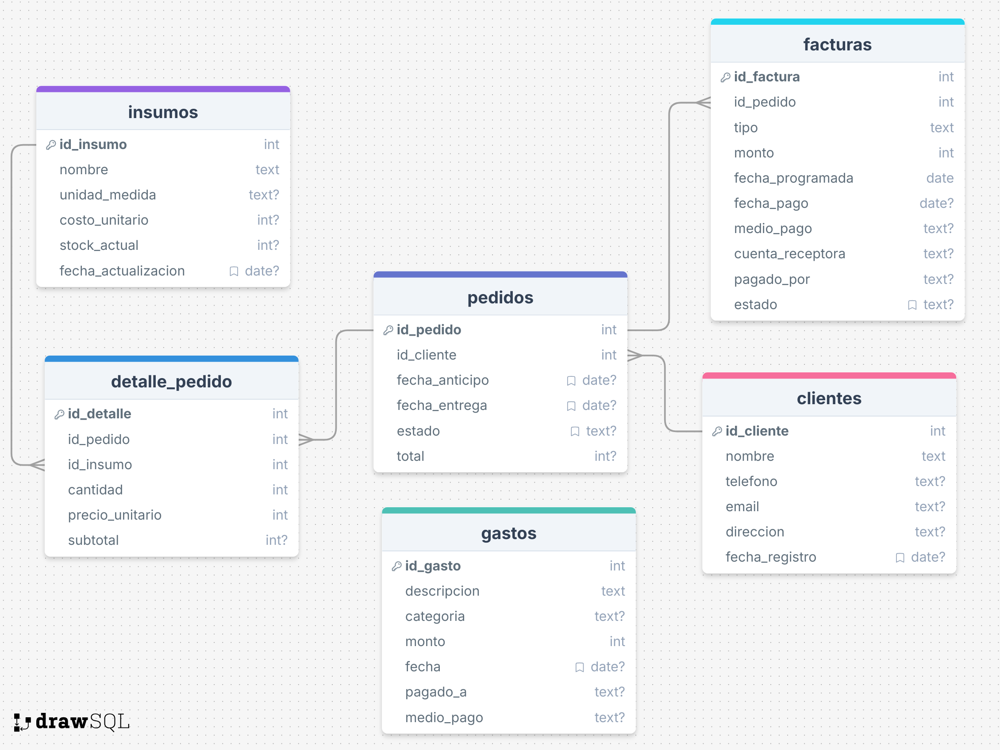

<!-- Language selector / Selector de idioma -->

  <a href="#en">🇬🇧 English</a> | <a href="#es">🇪🇸 Español</a>

<!-- English version -->

# Data Visualization and Management Tool

## Overview

This repository contains a financial and operational data visualization and management tool, specifically designed for a small business. The original version is currently in use, while this repository showcases a test/demo version.

## Data Extraction and Storage

The tool features the following data management capabilities:

- **Google Drive Integration**: Utilizes Google Cloud APIs to extract information directly from Google Drive, enabling synchronized and up-to-date work. (For demonstration purposes, this version generates simulated data locally.)
- **Relational Database**: Data is stored in a local `.DB` file within the Streamlit.io app.

### Data Structure

## Deployment

The tool is built with accessibility and ease of use in mind:

- **Platform**: Developed in Streamlit, offering:
  - Free and straightforward deployment
  - Multi-device access (computers, tablets, mobile devices)
  - Clean and responsive interface

### Demo Access

You can access the test version here:  
🔗 [https://d2caps-inicio.streamlit.app/](https://d2caps-inicio.streamlit.app/)

**Note**: If the page is in sleep mode, simply press the button to start the application. The process takes less than 20 seconds.

## Technologies Used

- Streamlit
- Google Cloud APIs
- SQLite Database (.DB)

---

<!-- Spanish version -->

# Herramienta de Visualización y Manejo de Datos

## Descripción General

Este repositorio contiene una herramienta de visualización y manejo de datos financieros y operativos, diseñada específicamente para una pequeña empresa. La versión original se encuentra actualmente en uso, mientras que este repositorio muestra una versión de prueba/demostración.

## Extracción y Almacenamiento de Datos

La herramienta cuenta con las siguientes capacidades de manejo de datos:

- **Integración con Google Drive**: Utiliza Google Cloud APIs para extraer información directamente desde Google Drive, permitiendo un trabajo sincronizado y actualizado. (Para fines de demostración, esta versión genera datos simulados de manera local.)
- **Base de datos relacional**: Los datos se almacenan en un archivo `.DB` local en la app en Streamlit.io.

### Estructura de Datos

## Despliegue

La herramienta está construida pensando en la accesibilidad y facilidad de uso:

- **Plataforma**: Desarrollada en Streamlit, lo que permite:
  - Despliegue gratuito y sin complicaciones
  - Acceso multi-dispositivo (computadoras, tablets, móviles)
  - Interfaz limpia y responsiva

### Acceso a la Demo

Puedes acceder a la versión de prueba aquí:  
🔗 [https://d2caps-inicio.streamlit.app/](https://d2caps-inicio.streamlit.app/)

**Nota**: Si la página está en modo de suspensión, simplemente presiona el botón para iniciar la aplicación. El proceso toma menos de 20 segundos.

## Tecnologías Utilizadas

- Streamlit
- Google Cloud APIs
- Base de datos SQLite (.DB)
